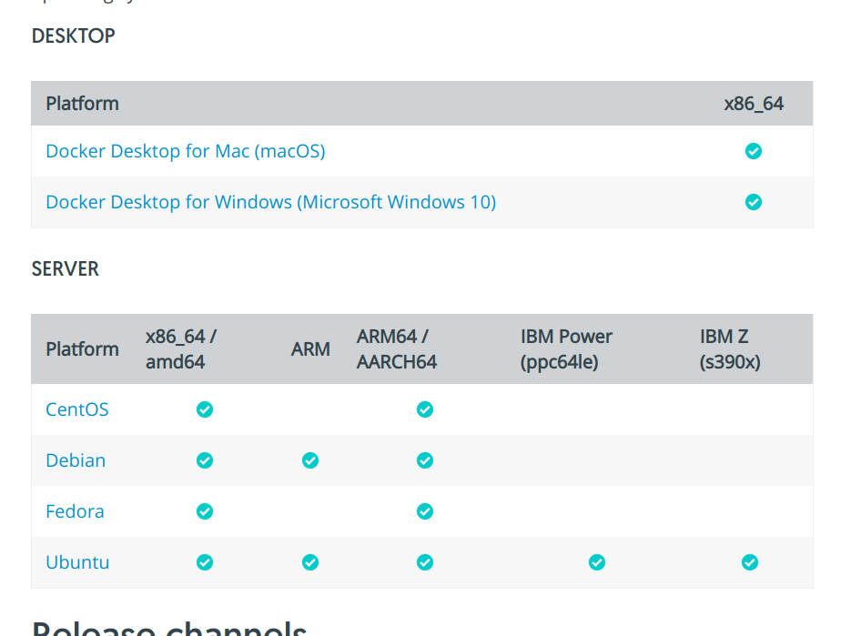
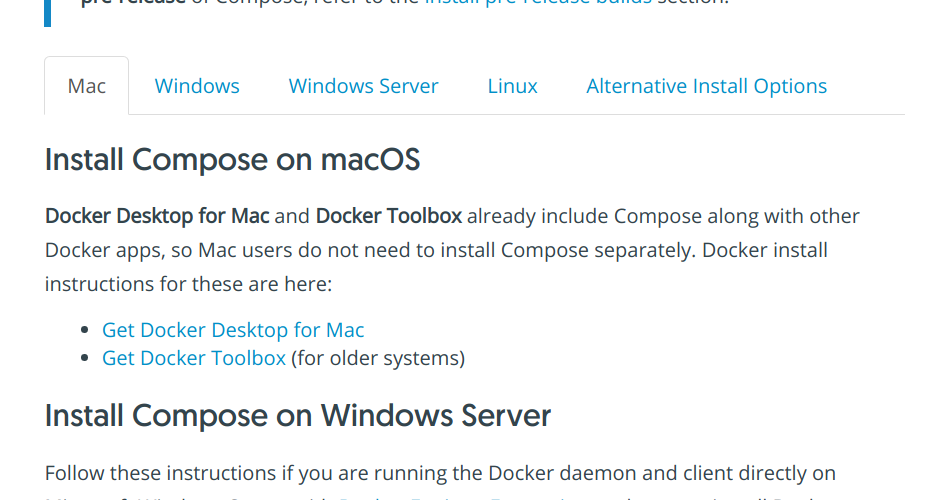
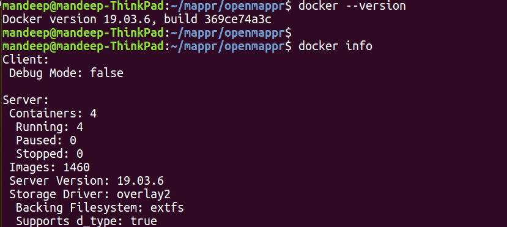
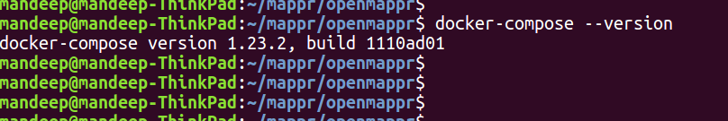
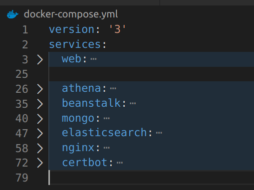
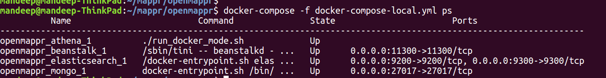

# openMappr - a network analysis and visualization platform

*openMappr* allows you to visualize and interactively explore relationship data as a network. You save multiple layouts and views as 'snapshots' and publish/share them with others as a 'player' (an interactive, read-only version of map).

There are 2 modes for using it:  

*1. Visualize Existing Network -*
In this case, you need an excel file with 2 sheets. One labeled 'nodes' and the other labeled 'links'.

The nodes sheet requires at minimum one columns called `id` (or `ID`) where every row is a unique node id. You can also include any number of additional columns as node attributes which can be used for coloring nodes, sizing nodes, selecting/filtering nodes, or laying out nodes in x-y space (e.g., as a scatterplot with links between the points). Node attributes can also include urls to images (which can be rendered as images within the node), video and audio links (which can be played within the visualization), the websites (hyperlinks), and twitter feeds (which can be rendered within the visualization for each node).

The links sheet requres at minumum two columns called `source` (or `Source`,`from`, `From`) and `target` (or `Target`, `target`, `to`). You can also include additional columns of link attributes for coloring links, or setting link thickness.

*2. Generating a Similarity Network from Node Tag Attributes -*
In this case you just need a 'nodes' file (.csv or .xlsx).

The nodes sheet requres at minumum two columns: one called `id` (or `ID`) where every row is a unique node id, and one column with a pipe-separated string of tags (e.g., 'tag1|tag2|tag3', or 'tag1 | tag2 | tag3').  Then openMappr can generate affinity links between nodes that have similar tag profiles.  The basic code for generating a similarity (or affinity) network from items with tags is available here https://github.com/foodwebster/Tag2Network


*A more complete user guide will be uploaded soon :) *
Mappr was originally created by Vibrant Data Inc., which was acquired by Rakuten Inc. in 2016.
openMappr was open-sourced in 2017.

## Setup

There are two ways to setup the application on your local machine or a server:

- Using Docker - Recommended if you want to quickly get the application up and running and don't need to make frequent changes
- Local + Docker Setup - Recommended if you are actively developing and testing the application

We will cover both the approaches one by one

For both the approaches, you will need to install **docker** and **docker-compose** so we will be covering that first

### Docker Installation

Docker installation instructions keep getting updated with newer versions of docker getting launched so the recommended way of installing docker for your OS is to follow the official installation instructions. Go to

https://docs.docker.com/install/

Scroll down a little and you should see links to installation instructions for different platforms



Click on the link for your platform and follow the installation instructions to install docker for your OS

### Docker-Compose Installation

Just like Docker installation, the best and recommended way to install **docker-compose** is to visit the official site. Go to

https://docs.docker.com/compose/install/

Scroll down a bit and you should see tabs for different platforms like Mac, Windows, Linux, etc.



Click the appropriate tab depending on your platform and follow the installation instructions to install docker-compose

### Verifying Docker and Docker-Compose installations

Once you have installed both **docker** and **docker-compose**, you can open the terminal window and type the following commands to check if your installation is working fine or not

```
docker --version
docker info
```

Output of these commands should look something like this:



Run the following command to verify **docker-compose** installation

```
docker-compose --version
```

Output should look something like this:




Now that we have both **docker** and **docker-compose** installed and working, we can proceed with setting up our application. As we previously mentioned, there are two ways to setup the application:

- Docker setup - Recommended if you want to quickly get the application up and running and don't need to make frequent changes
- Local + Docker setup - Recommended if you are actively developing and testing the application

First, we will cover the **Local + Docker setup** and then we will cover **Docker Setup**. If you only need to run the application and don't need to change any code, you can jump to **Docker setup** directly.

### Local + Docker setup

Our entire application can be broken down to multiple parts. In **docker-compose** terminology, we call these services. Each of these service runs in an isolated docker container. The services for our application are:

- Elasticsearch
- MongoDB
- Athena
- Beanstalk
- Web (our web application build in Express and AngularJS)
- Nginx
- Certbot

If you open the file **docker-compose.yml** and collapse everything at level 1, you should see the list of all the services. Here is a screenshot:



For this setup (Local + Docker), we use the file **docker-compose-local.yml**.

If you open that file, you should see the following services only:

- Athena
- Beanstalk
- MongoDB
- Elasticsearch

For running on our local machine, we don't need **nginx** and **certbot** services so we haven't added those. And to be able to quickly make changes to our web application code and test them, we haven't included the service **web** in the **docker-compose-local.yml** file. We will be running the web app locally. Hence, we call it **Local + Docker setup**.

To run this setup:

- Clone this repository to your local machine
- Go to project root directory (**openmappr**)
- Run the following command to bring up all the docker services

```
docker-compose -f docker-compose-local.yml up -d
```

If you're running it for the first time, it will take a while and once completed, it should create containers for all the services mentioned in our **docker-compose-local.yml** file. To verify that everything ran fine, run the following command


```
docker-compose -f docker-compose-local.yml ps
```

The output should look like this:




The **State** should be **Up** for all the services. If it is not, it means something is wrong

If all the services are up and running, great! Now we can proceed with the instructions for setting up our web app

For that, we need to:

- Install Node.js (We need Node version 8 for our project)
- Install Ruby
- Install Sass
- Install Compass

For Node.js installation, visit the official site and download the LTS version for your platform. As of March 14 2020, the LTS version of Node is 12.16.1. You can go ahead and install this. Then we will use **n** (a node module) to change the version of node to 8 which is required for our project. Once you have installed Node.js, it also installs **npm** (node package manager)

Go to terminal and run the following command to install **n**

```
sudo npm install -g n
```

**n** is a module which helps us change the version of node on our machine to whichever version we want. Run the following command to change the version of node to 8.12

```
sudo n 8.12.0
```

Once completed, you can run the following command to verify

```
node --version
```

The output should be:

```
v8.12.0
```

Now that Node.js is installed, next step is to install Ruby. If you're a Mac user, Ruby should be already installed on your system. For any other platform, I would recommend visiting the official site (https://www.ruby-lang.org/en/documentation/installation/) and follow the instructions

Once installed, run the following command in terminal to verify


```
ruby --version
```

The output will look something like this (version may vary based on your installation)

```
ruby 2.3.1p112 (2016-04-26) [x86_64-linux-gnu]
```

Once Ruby is installed, run the following commands to install **Sass** and **Compass** (if you face permission denied error, you might need to run the commands with **sudo**)


```
gem install sass
gem install compass
```

Then go to the project's root directory (openmappr) and run the following commands

```
sudo npm install -g yo bower grunt-cli
```

```
npm install
bower install
```

This should install all the dependencies for our web application. Once this completes, run the following command to bring our Express server up

```
./run_local_mode.sh
```

Then open another terminal window and run the following command to build the front end app:

```
grunt
```

Once this completes, run the following command to watch for changes

```
grunt watch
```

If everything is running fine without any error, it means you have successfully completed the setup and should be able to access the application from your browser.

Launch openMappr by opening a web browser and navigating to `http://localhost:8080`. Then enter `user@mappr.io` and password `woot`


**To stop the web app**, press `CTRL+C` on the windows where you ran `./run_local_mode.sh` and `grunt watch` commands

**To stop docker services**, run the command

```
docker-compose down
```

**If you later want to bring everything up**, run these commands (in this order):

- Run docker services

```
docker-compose -f docker-compose-local.yml up -d
```

- Run ExpressJS app

```
./run_local_mode.sh
```

- Build and run client app

```
grunt
grunt watch
```

**If docker images and volumes start taking up lots of space on your hard disk**, run this command from time to time:

```
docker system prune
```

This completes our instructions for **Local + Docker setup**. Next we will cover **Docker only setup** which is relatively easier and recommended if you only want to run the application and don't need to make any changes to the code

### Docker Setup

You can use Docker to install openMappr locally on your machine, or on a remote machine (e.g., AWS EC2). Note that if you install it locally on your laptop, you will have all the main functionality *except* you wil not be able to publish and share the interactive visualization with others.

- Install **docker** and **docker-compose** using the instructions mentioned above in this README file.
- Build the services by running the following command in the terminal from the project's root directory

```
$ docker-compose build --no-cache
```

- Run all services by executing the following command in the terminal from the project's root directory

```
docker-compose up -d
```

`docker-compose up` brings up all the services defined in the `docker-compose.yml` file in the project's root directory. The `-d` flag at the end will execute everything in the background. You can see the running containers by running the following command:

```
docker-compose ps
```

The output should look like this:

```
          Name                         Command               State                       Ports
-------------------------------------------------------------------------------------------------------------------
openmappr_athena_1          ./run_docker_mode.sh             Up
openmappr_beanstalk_1       /sbin/tini -- beanstalkd - ...   Up      0.0.0.0:11300->11300/tcp
openmappr_elasticsearch_1   /docker-entrypoint.sh elas ...   Up      0.0.0.0:9200->9200/tcp, 0.0.0.0:9300->9300/tcp
openmappr_mongo_1           docker-entrypoint.sh /bin/ ...   Up      0.0.0.0:27017->27017/tcp
openmappr_web_1             ./run_docker_mode.sh             Up      0.0.0.0:8080->8080/tcp
```

If the state is __Up__ for all the services, it means your setup is running fine.
You should be able to access the web-server.
Launch openMappr by opening a web browser and navigating to `http://localhost:8080`
then enter `user@mappr.io`  `woot`


### Useful Docker Compose Commands

These commands are only available from the project's root directory containing the `docker-compose.yml` file. You might find these helpful in your development and setup.

### View docker-compose logs for all the services/containers together

```
docker-compose logs -f
```

### View docker-compose logs for any particular service/container

```
docker-compose logs -f {service_name}
```

`{service_name}` here can be either of `athena`, `beanstalk`, `elasticsearch`, `mongo` or `web`. Basically these are the services as defined in your `docker-compose.yml` file.


### Pausing/Unpausing service(s)

You can pause a service by running the command

```
docker-compose pause {service_name}
```

When you pause a service, the state of that service will change to `PAUSED` in the `docker-compose ps` output. If you do not provide any `{service_name}` in the above command and only execute:

```
docker-compose pause
```

It will pause all the services. When you pause the services with compose, you can safely resume them from the state they were in when you left them. You may use this command before leaving your work at the end of the day, or shutting down your computer. When you run `docker-compose up -d`, everything will be the way you left it.

You can __unpause__ service(s) by using the `docker-compose unpause {service_name}` command. Similar to the __pause__ command, omitting the `{service_name}` will unpause all the paused services


### Rebuilding and Restarting a service

When you make changes to any of the services and want to see those changes getting reflected in your setup, you will need to rebuild that service. First, you will need to stop and remove the service using the `docker-compose stop` and `docker-compose rm` command:


```
docker-compose stop {service_name}
docker-compose rm {service_name}
```

Then, you need to rebuild the service. You can do so by running the following command:

```
docker-compose build --no-cache {service_name}
```

Then run the following command again to bring up the service:

```
docker-compose up -d
```

### Logging into the container running a service

Sometimes you might want to be able to login to a container running a particular service. For example, you might want to login to the container running the web app. You can do so by running the following command:

```
docker-compose exec web bash
```

This is a specific case of a more generic command. Basically `docker-compose exec` allows you to run a command on a container. So the general syntax is

```
docker-compose exec {service_name} {command}
```

For example, if you want to access the __mongo__ shell on the container running __mongodb__, you can do:

```
docker-compose exec mongo mongo
```

### Shutting down all the services

You can shutdown all the services and their respective container by running the following command:

```
docker-compose down
```


## Local + Docker Setup

If you are frequently changing the frontend code, you can use this setup to speed up your development process. You will still need to install both **docker** and **docker-compose** but we will use it only for running all the other services except our web application. For our web application (front end and backend), we will use a local setup. This way, you can easily use `nodemon` and `grunt watch` to automatically update the application code whenever you make any changes.

There are 2 scripts for running dev version of webapp:

- `run_local_mode.sh` - the most common. run the server in local mode

### Steps

These are the steps needed to get the full system running locally.

* Build webapp
    * Ensure all packages are installed by doing the steps listed in the _Setting up the node environment_ section.
    * `grunt` to build webapp. Then do `grunt watch` to watch for source code changes
* `./run_local_mode.sh` - for running the webapp
* Point your browser to `localhost:8080` and login as `user@mappr.io` with password `woot`.


## Sever-side Code Organization

Code is divided into top level modules, each with routes, controllers, models and services (if needed)

### Top Level Modules

* auth            - User authentication, includes passport config.
* common          - common elements like auth middlewares, permission middleware.
* commonOps       - commonOps module. has its own Readme.md file.
* config          - all common / dev / prod / testing config is made available as a module.
* data_api        - module for data api. makes networks available through the API
* datasys         - central data wrangling module. upload data, CRUD on dataset and networks.
* etl             - ETL pipeline. houses the ETL engine which runs scripts on spark cluster
* libs            - external libs outside of npm, mostly copy pasted code
* migrators       - migration code. Used when schema is changed, or need to run system wide validations
* misc_controllers- small controllers which interface with a service. like job / elasticsearch / svg / maintenance controllers
* models          - (depreciated -> contains schema for the old db. Used by survey and hence not removed)
* orgs            - module for organization management.
* player          - module for player managment. also contains a top_router for player specific routes
* project         - Project module. cloning, deleting and so on.
* recipe          - Recipe Engine module. each individual stage has its own file.
* schemas         - all schemas are here. This is because I feel they might be shared across multiple projects
* scriptStore     - contains script runner to run generic scripts on data. depreciated
* services        - common services needed by all modules
* snapshot        - Snapshot module.
* survey          - Survey module
* user            - User management module
* utils           - common utility functions. Also contains parsing code.

### Top Level files
- main_server.js - the server initialization code.
- main_router.js - Each modules furnishes its own router. Which is combined together in the this file.
- admin_router.js - similar to main_routers, for adminstrator account.
- misc_routes.js - bunch of routes, connecting misc_controllers
- routes.js - all routes which have not been ported over.
- ../server.js - entry point. Ensures node 5 is running.


## Setting up Node environment

The best way to setup Node is to use a node version manager. One way to do it is to use nvm.

* install nvm from https://github.com/creationix/nvm. follow the guide. Do not use brew to install it.

Also, when editing `~/.bashrc`, `~/.profile`, `~/.zprofile`, or `~/.zshrc`, use below:

```
export NVM_DIR="$HOME/.nvm"
export NVM_SYMLINK_CURRENT="true" # for editors to work properly
[ -s "$NVM_DIR/nvm.sh" ] && . "$NVM_DIR/nvm.sh" # This loads nvm
```

Also, if using zsh, update `~/.zshenv` or `~/.zprofile` instead of `~/.zshrc`:

* install node
```
nvm install 6.0
nvm use 6.0
nvm alias default node
```

* install basic packages
```
npm install -g yo bower grunt-cli
```

* install packages
```
npm install
bower install
```
* Run `grunt` to build the webapp. If developing, use `grunt watch` after that to watch for changes.

* Run `./run_local_mode.sh` to run the webapp.

## Sass

Sass and Compass need to be installed in order for sass to compile to css.

* Make sure ruby is installed first (by default on macs)
* install __sass__

```
gem install sass
```

[Sass install](http://sass-lang.com/install)

* install __compass__

```
gem install compass
```

[Compass install](http://compass-style.org/install/)

## Building OpenMappr on production server

1. SSH to the server `ssh -A -i privateKey.pem ec2-user@18.210.173.224`
2. To use your local Github account to run `git pull` on the repo on the server, make sure you've `ssh-agent` running on your local. I think Unix handles that by default, but not Windows (it's still not that cool).
3. Go into the `openmappr` directory
4. Run `nohup ./rebuild-prod-web.sh > output.log 2>&1 &`
5. To check status of the build process, run `tail -f output.log`. It usually takes around 10-15 mins, it sped up when I increased the server disk space from 100GB to 200GB.
